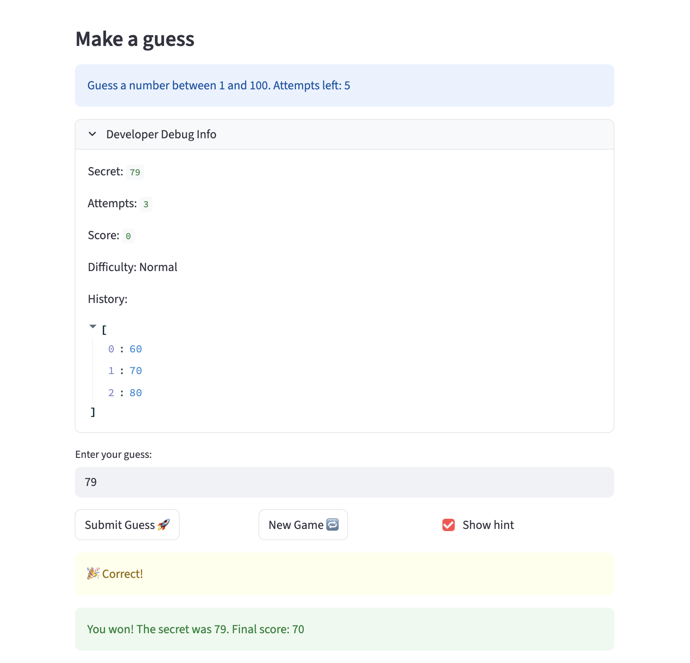

# 🎮 Game Glitch Investigator: The Impossible Guesser

## 🚨 The Situation

You asked an AI to build a simple "Number Guessing Game" using Streamlit.
It wrote the code, ran away, and now the game is unplayable. 

- You can't win.
- The hints lie to you.
- The secret number seems to have commitment issues.

## 🛠️ Setup

1. Install dependencies: `pip install -r requirements.txt`
2. Run the broken app: `python -m streamlit run app.py`

## 🕵️‍♂️ Your Mission

1. **Play the game.** Open the "Developer Debug Info" tab in the app to see the secret number. Try to win.
2. **Find the State Bug.** Why does the secret number change every time you click "Submit"? Ask ChatGPT: *"How do I keep a variable from resetting in Streamlit when I click a button?"*
3. **Fix the Logic.** The hints ("Higher/Lower") are wrong. Fix them.
4. **Refactor & Test.** - Move the logic into `logic_utils.py`.
   - Run `pytest` in your terminal.
   - Keep fixing until all tests pass!

## 📝 Document Your Experience

- [ ] Describe the game's purpose: The game is a simple number guessing game built with Streamlit. The player tries to guess a secret number within a limited number of attempts, and the game gives hints like higher or lower
- [ ] Detail which bugs you found: I found a few issues. The hint direction could be wrong sometimes. The game did not reject guesses outside the allowed range. The score could start incorrectly because of how attempts were counted. Also the difficulty setting did not properly change the guessing range
- [ ] Explain what fixes you applied: I fixed these by cleaning up the guess checking logic, adding input validation for the allowed range, and correcting how attempts start. I also used a function to set the number range based on the selected difficulty. 

## 📸 Demo

- [ ] [Insert a screenshot of your fixed, winning game here]

## 🚀 Stretch Features

- [ ] [If you choose to complete Challenge 4, insert a screenshot of your Enhanced Game UI here]
